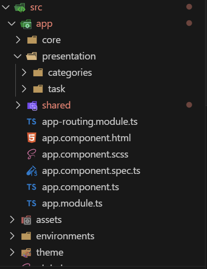

# 📝 To-Do App - Ionic + Angular

Aplicación móvil construida con Ionic y Angular que permite gestionar tareas de forma offline, con opción de sincronización en Firebase. Utiliza arquitectura por capas, almacenamiento local.

---

## 🚀 Características

- ✅ Crear, completar y eliminar tareas
- ✅ Crear, editar y eliminar categorias
- ✅ Asignar una categoría a una tarea
- ✅ Filtrar tareas por categoría
- ✅ Se implemento la paginación tanto en categorías como tareas
- ✅ Almacenamiento local con Ionic Storage
- ✅ Arquitectura por capas (Clean Architecture)
- ✅ Sincronización manual con Firebase Firestore
- ✅ Responsive y lista para dispositivos móviles

---

## 🧱 Estructura del proyecto


---

## ⚡ Instalación  

```bash
npm install
ionic cordova prepare
ionic serve
```

---

## 🔧 Construcción con Cordova  

```bash
ionic cordova build android
ionic cordova build ios
```

---

## 📌 Tecnologías utilizadas  

- ⚛️ **Angular**  
- ⚛️ **Cordova**  
- ⚡ **Ionic Framework**  
- 🔥 **Firebase Firestore**  
- 💾 **Ionic Storage**  


